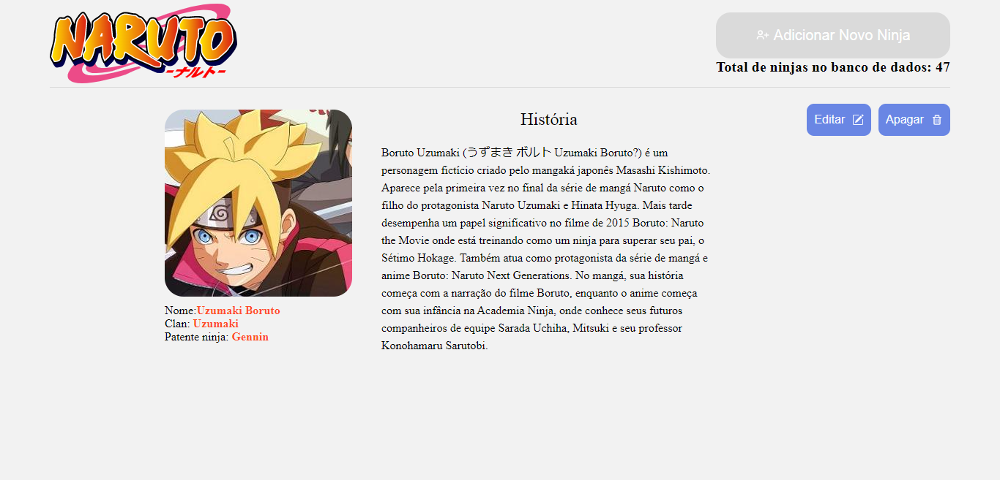

Um projeto feito inicialmente para ser uma "pokedéx" de Naruto, podendo ser alterado para qualquer tipo de uso.

Tecnologias utilizadas:
- React - https://reactjs.org/
- TypeScript - https://www.typescriptlang.org/docs/
- React Router Dom v6 - https://reactrouter.com/docs/en/v6/getting-started/overview
- React Modal - https://reactcommunity.org/react-modal/
- React Icons - https://react-icons.github.io/react-icons/
- Stitches - https://stitches.dev/
- Json Server - https://github.com/typicode/json-server
- Axios - https://axios-http.com/docs/intro

> O projeto foi iniciado com o Vite

# Segue abaixo a demonstração do site.

###### GIF mostrando a pagina funcional

###### Home Page

###### Modal de cadastro

###### Ninja Info Page

###### Modal de Edição de Personagem

###### Responsividade

- 768px:

- 425px:

